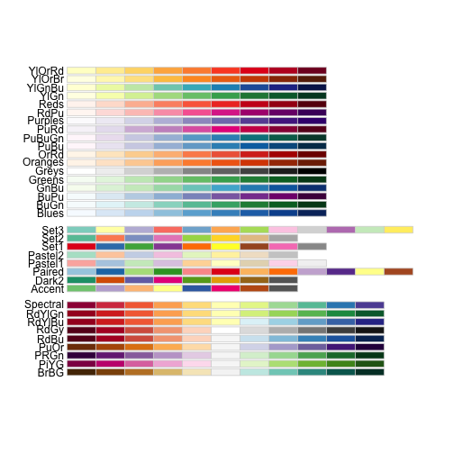

## Motywacja

    

--- &twocol w1:50% w2:50%

## Po co wizualizacja?

*** =left

> * <b>Użyteczność</b>: podejmowanie decyzji w oparciu o dane
> * <b>Maksymalizacja wpływu</b>: obraz jako medium wyników analizy 
> * <b>Estetyka</b>

*** =right

<!--

    

-->

    

--- .segue .quote .dark

<q> Tak więc estetyka może być pomocna w życiu   nie należy zaniedbywać nauki o pięknie</q>

--- bg:#FFF
## Jak zabieramy się za wizualizację?

> * Chcemy opowiedziec pewną historię, wizualizacja jest środkiem wyrazu
> * Notka PAP czy pobłębiona analiza?
> * Książka kucharska czy ,,Czarodziejska Góra"?
> * Strona techniczna

--- bg:#FFF
## Dobra wizualizacja

<!--https://pbs.twimg.com/media/C7DFVTgVwAUabFO.jpg-->

    

--- bg:#FFF
## Dobra wizualizacja

> * Jasny, zapadający w pamięć przekaz
> * Dopasowana do odbiorców (czytelnicy gazet, współpracownicy, kierownicy)
> * Dopasowana do sytuacji w jakiej będą odbierane
> * Wywieraja wpływ, przekazuje wiedzę, poszerza świadomość

    

--- bg:#FFF
## Zła wizualizacja

    

--- bg:#FFF
## Zła wizualizacja

<!-- http://smarterpoland.pl/wp-content/uploads/2017/01/z19705009QJak-wysokie-emerytury-dostaja-Polacy-.jpg -->

> * Celowo wprowadza w błąd odbiorcę
> * Przesycona zbędnymi informacjami
> * Niedokładna

    

--- bg:#FFF
## Zła wizualizacja

<!--http://smarterpoland.pl/wp-content/uploads/2017/01/Screen-Shot-2016-12-25-at-23.40.46-1024x1012.png -->

    

--- bg:#FFF
## Brzydka wizualizacja

<!--http://smarterpoland.pl/wp-content/uploads/2017/01/Screen-Shot-2016-12-25-at-23.13.38.png -->

    

--- &twocol w1:50% w2:50%
## Brzydka wizualizacja

*** =left

> * Trudna w interpretacji
> * Niecelowo wprowadzająca w błąd
> * Zawiera zbędne i nudne informacje

*** =right
<!--http://smarterpoland.pl/wp-content/uploads/2017/01/Screen-Shot-2016-12-25-at-23.13.38.png -->

    

--- bg:#FFF
## Case study

> * Dane dotyczące PKB na mieszkańca i ludności na świecie
> * Chcemy pokazać nierówności społeczne
> * Dane pochodzą z serwisu gapminder https://www.gapminder.org

--- bg:#FFF
## Kolory

> * Wyróżnienie informacji, umożliwienie rozpoznania grup
> * Dobór palety barw odpowiedniej do danych
> * Symulator schorzeń wzroku, np. http://www.color-blindness.com/coblis-color-blindness-simulator/

--- bg:#FFF
## Wybór palety barw 

--- bg:#FFF
## Wybór palety barw 

> * Skala ilościowa (uporządkowana)
> * Skala uporządkowana rozbieżna (z elementem neutralnym)
> * Skala jakościowa (nieuporządkowana)

--- bg:#FFF
## Wybór palety barw 

--- bg:#FFF
## Wybór palety barw 

--- bg:#FFF
## Wybór palety barw 

--- bg:#FFF
## Wybór palety barw 

--- bg:#FFF
## Wybór palety barw 

--- bg:#FFF
## Sposób przedstawienia danych

> * Te same dane można przedstawić na wiele sposobów
> * Jaki cel chcemy osiągnąć?

--- bg:#FFF
## Sposób przedstawienia danych

--- bg:#FFF
## Sposób przedstawienia danych - odpowiednia skala

--- bg:#FFF
## Sposób przedstawienia danych - kształt, kolor, rozmiar punktów

--- bg:#FFF
## Sposób przedstawienia danych - kształt, kolor, rozmiar punktów

<iframe src="diagram.html" width=100% height=100% allowtransparency="true"> </iframe>

--- bg:#FFF
## Inaczej

--- bg:#FFF

<iframe src="uszeregowane_pkb.html" width=100% height=100% allowtransparency="true"> </iframe>

--- bg:#FFF

--- bg:#FFF
## Źródła

* Przemysław Biecek, ,,Odkrywać, Ujawniać, Objaśniać! Zbiór esejów o sztuce prezentowania danych", 2014
* Edward Tufte, ,,Beautiful evidence"
* Gapminder, https://www.gapminder.org
* Symulator schorzeń wzroku http://www.color-blindness.com/coblis-color-blindness-simulator/
* https://www.r-bloggers.com/data-visualization-part-1/
* https://lisacharlotterost.github.io/2016/04/22/Colors-for-DataVis/
* Szychta w danych, www.szychtawdanych.pl
* pakiety: **ggplot2**, **highcharter**
